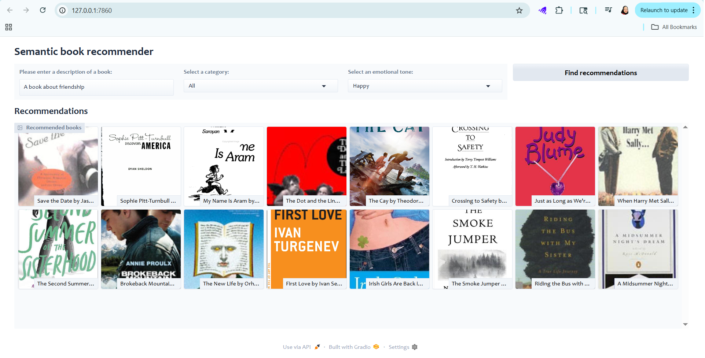

# 📚 Semantic LLM Book Recommender

Unlock your next favorite read with our Semantic LLM Book Recommender. This advanced system combines the power of Large Language Models (LLMs) and vector search to understand the deep meaning of book descriptions, offering highly personalized recommendations based on your query, category preferences, and even desired emotional tone.

## Analysis Notebook

View the full interactive analysis and code in the Jupyter Notebook:

[Data_exploration nbviewer](https://nbviewer.org/github/belquisshemy/llm_book_recommender/blob/main/data_exploration.ipynb)

[Vector_Search nbviewer](https://nbviewer.org/github/belquisshemy/llm_book_recommender/blob/main/vector_search.ipynb)

[Text_classification nbviewer](https://nbviewer.org/github/belquisshemy/llm_book_recommender/blob/main/text_classification.ipynb)

[Sentiment Analysis nbviewer](https://nbviewer.org/github/belquisshemy/llm_book_recommender/blob/main/sentiment_analysis.ipynb)

## Table of Contents

1. Features

2. Technical Stack

3. How It Works (Conceptual Overview)

4. Project Stages (Detailed Breakdown)

   - Stage 1: Data Exploration & Cleaning

   - Stage 2: Vector Search

   - Stage 3: Text Classification

   - Stage 4: Sentiment Analysis

   - Stage 5: Gradio Dashboard

5. Future Enhancements

6. License & Acknowledgements

## Features

- **Semantic Search:** Find books based on the meaning of your query, not just keywords.

- **Category Filtering:** Filter recommendations by broad categories like Fiction or Nonfiction.

- **Emotional Tone Re-ranking:** Discover books that align with a desired emotional tone (e.g., Happy, Sad, Surprising, Angry, Suspenseful).

- **Interactive Web UI:** A user-friendly interface built with Gradio for seamless interaction.

- **Efficient Data Handling:** Utilizes ChromaDB for fast vector similarity searches and persistence to avoid repeated API calls.

## Technical Stack

### Core Technologies

- **Vector Search**: OpenAI Embeddings + ChromaDB
- **Text Classification**: Facebook BART (facebook/bart-large-mnli)
- **Sentiment Analysis**: DistilRoBERTa (j-hartmann/emotion-english-distilroberta-base)
- **Orchestration**: LangChain
- **UI Framework**: Gradio
- **Data Processing**: Pandas, NumPy

### Key Features

- Persistent vector storage (no repeated API calls)
- Zero-shot classification for book categories
- Multi-emotion sentiment scoring
- Real-time semantic search

## How It Works (Conceptual Overview)

The recommender system operates by first understanding the deep meaning of book descriptions using advanced AI models. These descriptions are converted into numerical "vectors" and stored in a specialized database. When a user provides a query, it's also converted into a vector, and the system efficiently finds books with the most semantically similar vectors.

Beyond semantic similarity, the system refines recommendations using pre-calculated broad categories (Fiction/Nonfiction) and the emotional tones derived from each book's description. This multi-faceted approach ensures highly personalized and relevant book suggestions.

## Demo

## Project Stages (Detailed Breakdown)

### Stage 1: Data Exploration & Cleaning

This initial stage focused on preparing the raw book dataset obtained from Kaggle for effective use in the recommendation system.

- **Data Source:** The dataset was sourced from Kaggle.

- **Bias Analysis & Missing Data Handling:**

  - An investigation was performed into missing descriptions to detect potential recommendation bias. The analysis aimed to understand if these books shared common characteristics (e.g., older publication years, shorter page counts, specific genres) that could introduce systematic bias.

  - As missing descriptions constituted less than 5% of the dataset, these books were safely dropped to ensure data quality without significant skew.

- **Description Length Filtering:** Books with descriptions less than 25 words were dropped to ensure that only sufficiently descriptive entries were used for analysis.

- **tagged_description column creation:** with each book description include book's ISBN followed by description, enabling the vector database to accurately trace back a retrieved description to its corresponding book's information.

### Stage 2: Vector Search

This stage forms the semantic core of the recommender, allowing searches based on the underlying meaning of text.

- **Technology Stack:** Leverages LangChain for orchestration, OpenAI Embeddings for vector generation, and ChromaDB as the vector store.

- **Process:**

  1. Raw book descriptions (tagged_description column) are loaded as Document objects.

  2. A CharacterTextSplitter is configured (separator="\n", chunk_size=0) to ensure each line (representing one book's description) is treated as a distinct "chunk" or document, ready for embedding.

  3. OpenAIEmbeddings() transforms these text chunks into high-dimensional numerical vectors (embeddings), effectively capturing their semantic meaning.

  4. These embeddings, along with their original text content, are stored in a persistent ChromaDB instance (db_books). This persistence is critical: embeddings are generated only once (on the first run), significantly reducing OpenAI API costs and speeding up subsequent application launches.

- **retrieve_semantic_recommendations Function:** This central function accepts a user's textual query, converts it into an embedding using the same OpenAI model, and performs a similarity_search within db_books. It retrieves the initial_top_k (default 50) most semantically similar book descriptions. The ISBNs extracted from these retrieved documents are then used to filter the main books DataFrame to fetch comprehensive book details.

### Stage 3: Text Classification

This stage integrates a layer of categorical understanding into the recommendation process.

- **Zero-shot Classification:** The project utilizes the facebook/bart-large-mnli model from Hugging Face for zero-shot text classification. This powerful technique allows the model to classify text into categories (like "Fiction" or "Nonfiction") without explicit prior training on these specific labels.

- **Category Mapping:** To simplify and standardize categorization and enhance filtering capabilities, book categories with more than 50 occurrences in the dataset were pre-processed and broadly mapped into either "Fiction" or "Nonfiction".

- **Post-processing:** Specific logic was implemented to extract the most confident predicted label from the classifier's output.

- **Model Evaluation & Application:** The classification model demonstrated an accuracy of 74.83%. Given this robust performance, the model was employed to fill in missing category information for books within the dataset. This ensures that the category filtering functionality is comprehensive and reliable.

### Stage 4: Sentiment Analysis

This stage adds a nuanced emotional dimension, allowing users to specify a desired emotional tone for their recommendations.

- **Objective:** To determine the prevalent emotional tone of book descriptions, thereby enabling refined filtering or re-ranking of recommendations based on user emotional preference.

- **Target Categories:** Emotional tones are classified into 7 distinct categories: "anger", "disgust", "fear", "joy", "sadness", "surprise", and "neutral".

- **Model Used:** The j-hartmann/emotion-english-distilroberta-base model from Hugging Face was used for sentiment analysis.

- **Process:** For each book's description, the following steps were taken:

  1. The description is first split into individual sentences.

  2. Each sentence is passed through the sentiment analysis classifier, yielding a probability score for each of the 7 emotion categories.

  3. Crucially, for each book, the highest score observed for each of the 7 emotions (across all its sentences) is extracted. These 7 maximum percentage scores are then added as new, dedicated columns to the main book DataFrame.

- **Goal of Max Scores (Re-ranking):** The purpose of storing these maximum emotion percentages for each book is to facilitate re-ranking recommendations based on a user's chosen emotional tone. When a user selects a tone (e.g., "Happy", "Suspenseful"), the retrieve_semantic_recommendations function sorts the already semantically relevant and category-filtered books by the corresponding emotion's maximum score (e.g., "joy" for "Happy", "fear" for "Suspenseful"). This effectively brings books with the strongest presence of that specific emotion in their descriptions to the top of the recommendation list.

### Stage 5: Gradio Dashboard

The final stage integrates all the intelligent components into an interactive, user-friendly web application.

- **Framework:** The web interface is built using Gradio, known for its simplicity and speed in creating ML demos.

- **User Interaction:**

  - A Textbox allows users to input a descriptive query (e.g., "A story about forgiveness").

  - Dropdown menus enable optional filtering by broad book category (Fiction/Nonfiction) and selection of a desired emotional tone.

  - A clear "Find recommendations" Button triggers the recommendation logic.

- **Dynamic Output:** Recommendations are presented in a gr.Gallery component, visually showcasing book thumbnails alongside rich captions that include the book's title, formatted author(s), and a concise, truncated description.

## Future Enhancements

- **User Feedback Loop:** Implement a mechanism for users to provide explicit feedback on recommendations (e.g., likes/dislikes), which could be used to further personalize or fine-tune the system.

- **Robust Deployment:** Migrate the application to a more scalable and reliable hosting platform (e.g., Hugging Face Spaces, Render, AWS, GCP, Azure) for continuous availability and better resource management.

## Acknowledgements

- Kaggle for providing the initial book dataset.

- Hugging Face for the excellent open-source sentiment analysis and classification models (facebook/bart-large-mnli, j-hartmann/emotion-english-distilroberta-base).

- LangChain for simplifying the development of LLM-powered applications.

- Gradio for the user-friendly and rapid UI development.

- OpenAI for their powerful embedding models.

- A special thank you to [freeCodeCamp/Jodie Burchell] for the insightful tutorial that served as a foundational learning resource for this project: [LLM Course – Build a Semantic Book Recommender (Python, OpenAI, LangChain, Gradio)].
